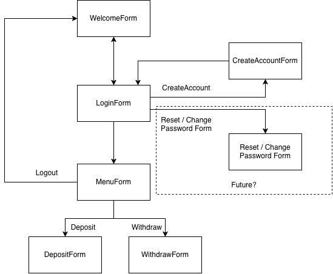

# 開發注意事項

如果有疑問歡迎討論～

## 頁面架構

## 視窗大小

目前視窗大小已藉由以下設定固定：
- FormBorderStyle = `FixedSingle`
- MaximizeBox = `False`
- Size = `1200, 700`。

## 請先觀察 

- 檔案架構
- namespace
- 如何進行頁面跳轉（請看 `WelcomeForm.cs` 的 `startButton_Click()`）
- 如何存取使用者資訊（請看以下）
- 字體大小可參照 WelcomeForm

## 使用者資訊

有關使用者的資訊的 class 位於 `Services/AccountService.cs`，使用範例請看同目錄底下的 `ExampleUsage.cs`。

### 範例測試

範例測試檔案為 `Services/ExampleUsage.cs`，欲執行該測試檔案，請：

- 於專案管理（Solution Explorer） 頁面右鍵 dotATM（本次專案），並於 一般(General) > 輸出種類(Output type) 切換至 **控制台應用程式 (Console Application)**
- 打開 Program.cs，**取消註解第一行**

欲切換回來，請：
- 於專案管理（Solution Explorer） 頁面右鍵 dotATM（本次專案），並於 一般(General) > 輸出種類(Output type) 切換至 **視窗應用程式 (Windows Application)**
- 打開 Program.cs，**註解第一行**

請注意，請盡量不要 commit 到你修改過的 Program.cs，避免之後 merge 到測試 code。XD

## Branch

目前主要開發 branch 為 dev。我已新增不同 branch，請依照以下分工表使用該 branch，請勿修改非你 branch 所該改的東西，避免 merge 衝突。

- feature/CreateAccountForm @吳崇豪
- feature/LoginForm @賴宥亘
- feature/transaction-forms @姜冠慈